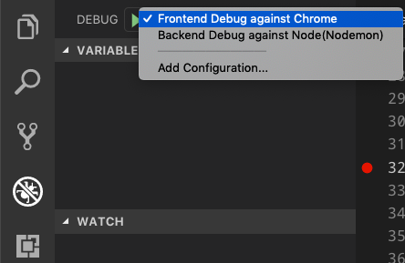
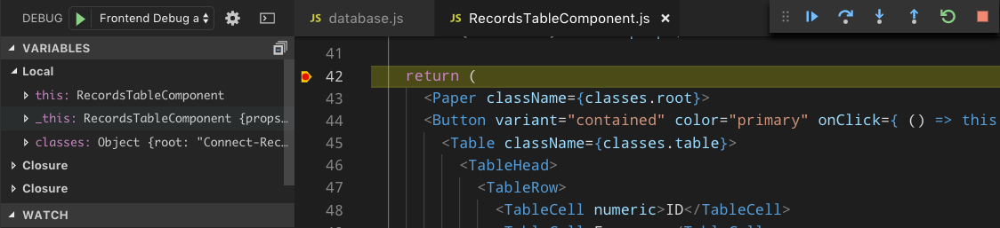
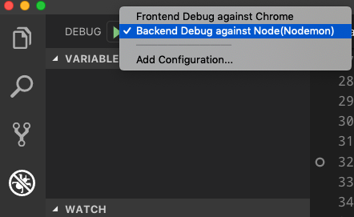
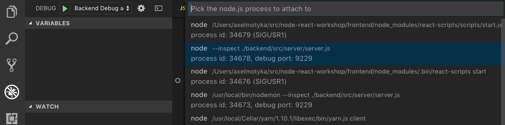
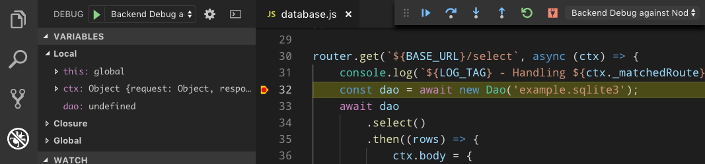

# node-react-workshop

## Setup & run
1. Clone this repo!
2. You need `node` and `yarn` installed
3. Change to `node-react-workshop` directory
4. run
   ```
    npm i nodemon -g
    npm i
   ```
5. Change to `frontend` and run `npm i`
6. Change to `backend` and run `npm i`
7. change back to root and run `yarn dev` - this will start frontend and backend!
8. When opening `http://localhost:3000` you should see the frontend!
9. When opening `http://localhost:8080` you should see a welcome JSON from the backend.
10. In VS Code on the `Extension`-Tab add `ESLint`.
11. In VS Code on the `Extension`-Tab add `Prettier - Code formatter`
12. In VS Code on the `Extension`-Tab add `SQLite`

## Debugging
Debug connection is set in the `.vscode/launch.json`. 
If the project is started by using the `yarn dev` command from the projects root, both projects are started!
Backend can be run seperated from the frontend, cause of this the frontend directory does not contain an additional `.vscode/launch.json`!

### Frontend
Inside VS Code the debugger must be connected to Chrome. 
So first install the VS Code extension `Debugger for Chrome`, then on the debug tab start `Frontend Debug against Chrome`.



### Backend
Inside VS Code the debugger must be connected to Node. 
Do do so click on the debug tab and start `Backend Debug against Node(Nodemon)`.




## Structure
Inside `backend` you find your backend-server, more is described in the backends README.md.

Inside `frontend` you find your frontend as React app, more is described in the frontends README.md.

## Campusweek 2
All needed infos will be in [Campusweek2 Powerpoint](./Campusweek2.pptx)